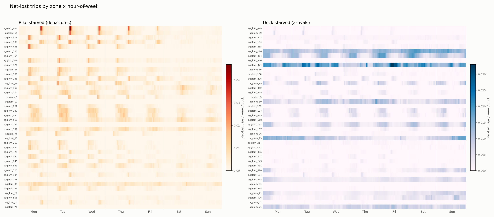
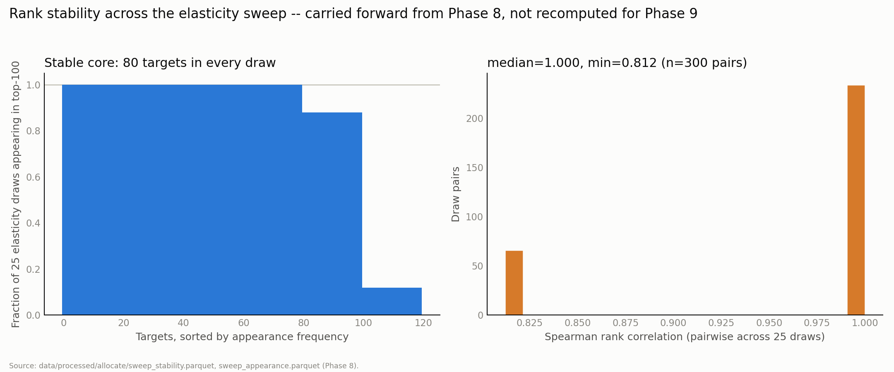

# Citi Bike Incentive Allocation

## 1. The decision

Fund the incentive program at **~$400/week — sized to what the allocator can actually spend on
positive-net-value targets, not to the $10,000 budget ceiling.**

That number rests on a methodology result worth stating before the dollar figure, because it's
what makes the dollar figure trustworthy rather than a coin flip: the first pass at measuring lift
pooled fill rate over the *whole* network (~875K trips/week) and came back statistically
indistinguishable from zero for every policy tested — 0 of 5 bootstrap CIs excluded zero, on the
same 40 replicates. That result was wrong to read as "underpowered." Every policy funds at most a
few thousand trips against that 875K-trip denominator, which dilutes any real effect below the
noise floor regardless of how many more replicates you run. Restricting the *same* 40 replicates
and the *same* random seeds to just the (station, hour) cells each policy actually funded — paired
against a do-nothing run on those identical cells — flipped 4 of 5 policies from indistinguishable-
from-zero to a lift every single replicate agreed was positive (100% of replicates, for uniform
spend, proportional spend, naive top-N, and the full-budget allocator alike). Same data, same
randomness, only the denominator changed. It's the single most instructive result in this project:
a lesson in measurement design, not in statistical power.

Once the effect is actually visible, the honest picture is a split, not a clean sweep. Our
allocator **dominates on cost efficiency** — $1.34 per recovered trip vs. naive top-N's $17.14, a
90% CI on that gap that sits entirely below zero, not just a better point estimate. But given the
*same* $10,000 budget as top-N, it only **ties** top-N on raw fill-rate lift (+2.06pp vs. +2.56pp;
the CI on the difference straddles zero, and top-N's point estimate is if anything slightly ahead).
That's reported as a tie, not a win. Past its own ranked candidate pool the allocator has nothing
left worth funding: pushing it from its natural $377/week to the full $10,000 spends the remaining
~$9,600 at a **marginal cost of $19.74/trip** (90% CI $11.28–$68.17, paired by replicate) — roughly
**15x** the $1.34 the first $377 buys, because the extra spend is chasing the same low-value tail
top-N is already paying full price for. The $400/week program buys exactly what natural spend
produces: **+0.56pp lift on its treated cells** (90% CI −0.63 to +1.94 — the one of the five where
the interval still touches zero, P(lift>0)=72%), **~234 trips recovered, $1.34/trip.** Recommendation:
don't size the program to the budget ceiling — size it to the opportunity, the ~$400/week where the
allocator's own ranking runs out of genuinely positive-net-value targets.

## 2. Why unmet demand had to be estimated

Trip logs only record completed trips — a rider who walks up to an empty station and leaves records
nothing. That undercounts demand exactly where the station is failing, which is worse than random
noise. Fix: flag every 15-minute interval a station sat at zero bikes or zero docks (stockout
*minutes*, not a binary), fit the demand model only on unaffected intervals, then predict what
demand would have been during the flagged ones.

Not every failed trip is truly lost — a rider turned away often walks to a nearby station instead.
Netting departure-side unmet demand by real substitution (nearest station within 400m absorbing the
uplift) splits it **66.9% displaced / 33.1% net-lost**: two-thirds of "failed" trips happen close by
anyway; the remaining third is the real target.

Validated by artificial censoring — truncate a known-good, *uncensored* interval at a fake inventory
cap, then check whether the model recovers the true count, since there's no ground truth for
intervals that were genuinely censored. Matched-sampling recovery (stratified by predicted-demand
decile, capacity band, and hour-of-week — a flat/unmatched draw undercounts low-volume strata badly
enough to matter) recovers known-injected demand to within **±0.02 bias**.

## 3. The heatmap

Station × hour-of-week matrix of estimated net-lost trips, split into bike-starved (can't start)
and dock-starved (can't end) panels. The commuter dipole shows up as predicted: residential Upper
West Side zones (Riverside Dr & W72 St, Central Park W & W68–72 St) are bike-starved 8–9am; Midtown
is close to the mirror image.

Ranked by **per-dock lower confidence bound** — mean per-dock rate minus 1.96×SE across each
zone-hour's ~52 individual weekly observations — not raw volume (tracks zone size, buries small
residential zones) and not the raw per-dock mean either (lets a couple of lucky weeks win). The
bound is honest about what it finds: a real but non-commute pattern also surfaces — two small Long
Island City/Maspeth zones (57–76 total docks) rank #1–2 dock-starved, on a genuine Saturday-morning
signal (present in 40+ of 52 weeks), not noise and not a commuter pattern either.

Jersey City/Hoboken — a physically separate sub-fleet across the Hudson — is excluded from zone
rankings via a geographic bounding box on each zone's centroid, calibrated against real station
coordinates (a name/ID heuristic was tried and rejected — it misclassifies real stations, e.g. a
Jersey City "Dey St" easily confused with Manhattan's FiDi Dey Street). The systematic pass caught
**39 zones**, not just the 7–8 visually obvious ones sitting in the raw top rows.

## 4. Allocation logic

Moving a bike costs the origin: net value of an incentivized move o→d is **MV(d) − MV(o) − cost**,
not just the destination's gain — origins must be genuine surplus, priced from their own worst
historical inventory level, not assumed free. That makes it a flow problem, not a ranking problem.

Marginal value MV(s,t,k) — expected trips saved by the k-th bike added — is only measured for
**k ≤ 4** (`mv_k_max`): two independent methods (a queueing-theoretic model and an empirical
cross-check) agree the value is negligible above that. Cells that ever reach k≤4 are 70.1% of the
379,019-cell universe but carry 99.9% of net-lost demand, so the truncation costs almost nothing.

Demand concentrates hard in a chronic tail: cells low more than half their observed weeks are only
**7.4% of all cells but carry 44% of total net-lost demand**. 99.6% of those chronic cells also
recur at nearly the same 15-minute slot almost every low week — schedulable — which is why the
allocator is two-tier, not one dynamic policy. **Tier 1** (chronic + schedulable) gets a standing
weekly incentive at (station, hour-of-week), no live feed needed. **Tier 2** (everything else) needs
real-time, state-triggered incentives — closer to what Bike Angels does today.

## 5. Full results table

RUNBOOK's spec called for 100 bootstrap replicates minimum; this ships with **40**. The honest
constraint is compute, not design — each replicate reruns the full-week simulator 6 times (~30
min/replicate on this machine), and 40 was what completed before this writeup was due. CIs below are
real for n=40, not padded to look tighter.

Restricted to each policy's own funded (station, hour) cells, paired against do-nothing on the same
cells and seed — see §1 for why the system-wide version is diluted to noise (kept for reference in
`reports/policy_comparison.md`).

| Policy | Lift, treated cells (90% CI) | Trips recovered | $ spent | $ / trip |
|---|---|---|---|---|
| Uniform spend | +2.13pp (+0.85, +3.19) | +801 | $10,000 | $12.49 |
| Proportional to volume | +1.96pp (+0.68, +3.10) | +762 | $10,000 | $13.15 |
| Top-N stockout (naive) | +2.56pp (+0.48, +4.03) | +569 | $9,995 | $17.14 |
| **Our allocator** (natural, $377/wk) | +0.56pp (−0.63, +1.94) | +234 | $377 | **$1.34** |
| Our allocator (full budget) | +2.06pp (+0.55, +3.08) | +793 | $9,999 | $12.64 |

4 of 5 policies hit P(lift>0) = 100% across all 40 replicates; only the natural-spend allocator's CI
still touches zero (P=72%), consistent with it simply buying less treatment than the other four's
~$10,000.

## 6. Limitations

**Elasticity is the weakest link, and unvalidatable with this data.** The incentive response curve
(Δmoves = a·(1−e^(−b·payout))) is a stated parametric *assumption*, not fit to anything — this
dataset has no field for Bike Angels point values or any other payout history, so the strongest
option (a regression discontinuity at real point thresholds) was never available. Mitigated, not
solved: the allocator's top-100 *ranking* is stable across a 25-draw elasticity sweep (Spearman min
0.812, median 1.000; an 80-target stable core) — robust to the elasticity guess being wrong, not
proof the guess is right.

**The simulator can't supply station-level truth.** Simulated per-(station, hour-of-week) stockout
timing doesn't correlate with real ground truth (pooled corr plateaus ~0.10 across 6 held-out
weeks) — a structural limit of resampling destinations from historical marginals, not a tuning
problem. Every lift number in this project is system- or zone-level; no per-station fill-rate
number appears anywhere, by construction.

**Station capacity is a single present-day snapshot, applied retroactively across the whole panel
year.** GBFS has no historical capacity endpoint. 329 stations (14.5% of the usable network) show
capacity below their own observed peak-interval throughput, associated with 44% of inferred
non-trip bike movement — a plausible, unconfirmed pool of stale-capacity error, left open rather
than filtered without real evidence most of it is wrong.

## 7. Validation plan

Counterfactual simulation isn't causal proof. The real test: a **switchback design**, randomizing
incentive policy (ours vs. status quo) at the zone-week level, with geographic clustering + buffer
zones — adjacent zones spatially interfere, so a treated zone can pull demand from an untreated
neighbor.

**Primary metric:** fill rate. **Guardrails:** cost per recovered trip, rider wait/walk time, and
whether gains just cannibalize adjacent untreated zones.

**Power calc, using this project's own observed variance** (median per-zone fill-rate SD = 1.8pp
across the 40 bootstrap replicates, as a proxy for real week-to-week variance): detecting a 1pp lift
at 80% power needs **~52 zone-weeks per arm**; a 2pp lift needs **~13**. With ~542 zones in the
network that's fast in principle — but zones aren't independent units (the same spatial interference
above), so real geographic clustering pushes the true requirement well past the naive arithmetic. A
single quarter is a reasonable target, not a guarantee.

**Gaming risk:** Bike Angels-style incentives are known to be farmable. Any real deployment needs
anti-abuse constraints — cooldowns, per-user caps, minimum trip distance — before the switchback
even starts.
